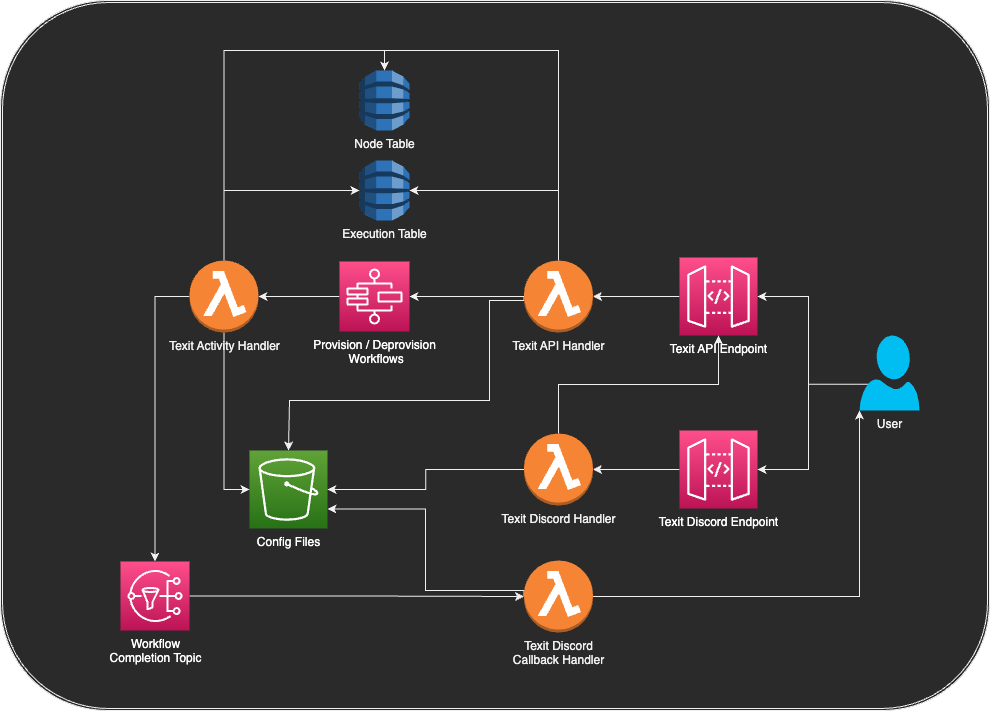

# Texit Serverless

Texit can be deployed as a serverless application to AWS. You might choose this often if you don't have local infrastructure to deploy to or are unable to route requests in your network.

Deploying this way has cost to it, however nothing in this setup is very intensive. Resource deployed in this setup (besides storage) only charge per request, so with occasional use it'll likely cost pennies a month while having the services "always on".

## Architecture

Running Texit as a serverless application on AWS involves using the following services:

- API Gateway: Provides endpoints to call the services.
- S3: Stores application configurations.
- Lambda: Provides the compute for requests. 3 lambdas are deployed, an API handler, a Discord handler, and a Step Functions activities handler. All of these load their config from S3.
- DynamoDB: Database for storing nodes and executions.
- Step Functions: Orchestrates the execution of the Texit workflow.
- SNS: Used to notify of workflow completions.

The following diagram shows the architecture of the serverless deployment.



## Deployment

Because numerous dependencies have to be configured to run Texit this way, the recommended deployment approach is with AWS-CDK. A [CDK construct package](https://github.com/awlsring/texit-constructs) is provided that allows for easily defining your deployment code. You can install this with `npm i texit-constructs`. This package contains predefined stacks that can be used to deploy, but if you need to customize the deployment all the resources are also exposed as constructs you can use to define your own stacks.

If you are familiar with CDK, its pretty easy to get started with. Try following [this guide](https://docs.aws.amazon.com/cdk/v2/guide/getting_started.html) to get started and learn some basics.

A full example of a CDK project that deploys Texit can be found in the [examples directory](/examples/serverless/).

### Using the CDK Constructs

To deploy using the constructs you will need to provide the binaries for the lambdas and your config files for your application. This section will cover how to set these up using the [example](/examples/serverless/) as a reference.

#### Config

Texit deployed this way will pull its config from an S3 bucket. In the example, this is deployed in the `TexitStatefulResourcesStack` via a `BucketDeployment` construct. This is configured to upload the config files in the `assets/config` directory to the bucket.

This bucket is passed to various stacks so that the handlers are told to pull their config from it.

If deploying this way, all files under the `assets/config` directory will be uploaded to the bucket, keeping their same names. To allow each Lambda to pull the proper config, you can specify a `configObject` property on the stack/construct that will be used as the object to pull from the bucket. If this is not specified, each lambda will attempt to pull a `config.yaml` object from the bucket.

As example, here is how the `TexitDiscordBotStack` is configured to pull its config of `bot-config.yaml` from the config bucket.

```typescript
new TexitDiscordBotStack(app, "TexitDiscordBotStack", {
  botBinary: Code.fromAsset("assets/bin/texit-discord"),
  callbackBinary: Code.fromAsset("assets/bin/texit-discord-callback"),
  configBucket: resources.configBucket,
  configObject: "bot-config.yaml",
  texitEndpoint: texit.api.url!,
  callbackTopic: resources.notifierTopic,
});
```

#### Binaries

Binaries need to be provided as a `Code` object to the lambda. The stacks/constructs exposed accepts these under a `binary` field on their properties.

You'll need to download these from the releases and locate them somewhere in your project.

The binaries that are need are...

- `texit-lambda_Linux_arm64.tar.gz` - This will be used as the binary for the Texit API handler.
- `texit-lambda_sfn_activities_Linux_arm64.tar.gz` - This will be used as the binary for the Step Functions activities.
- `texit_discord_lambda_Linux_arm64.tar.gz` - This will be used as the binary for the Discord handler.
- `texit_discord_callback_lambda_Linux_arm64.tar.gz` - This will be used as the binary for the Discord callback handler.

**Note:** Arm binaries are specified as these constructs default to deploying to the `arm64` architecture. If you have some reason to use `x86_64` you can specify this in the `architecture` property of the lambda.

The examples has these binaries unzipped and keeps them under a `assets/bin` directory. To deploy them the same way they are in the example using `Code.fromAsset`, you will need to rename these binaries to `bootstrap` and place them in a unique directory for each lambda. In the example, the following file structure is used:

_The `bootstrap` naming is needed as these lambda run using the `provided.AL2023` runtime, which has this naming pattern as a requirement._

```plaintext
assets
└── bin
    ├── texit
    │   └── bootstrap
    ├── texit-activities
    │   └── bootstrap
    ├── texit-discord
    │   └── bootstrap
    └── texit-discord-callback
        └── bootstrap
```

You would then specify these directories as the `asset` for the lambda.

```typescript
const texit = new TexitApiStack(app, "TexitApiStack", {
  binary: Code.fromAsset("assets/bin/texit"),
  ...
});
```
